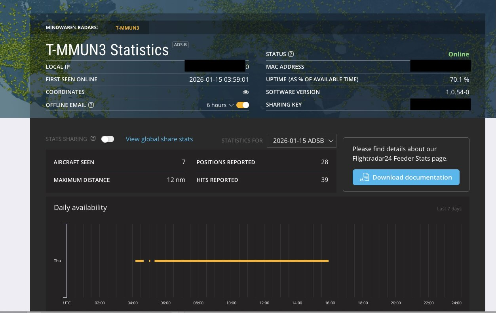
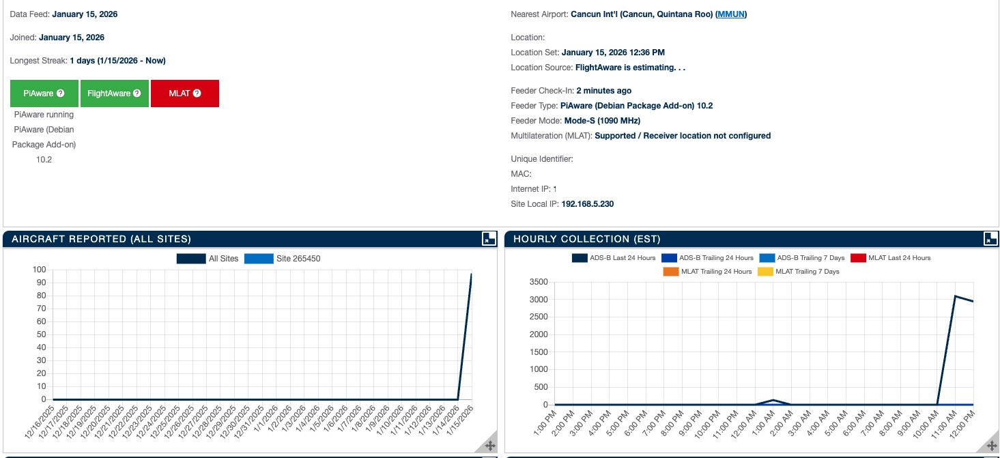
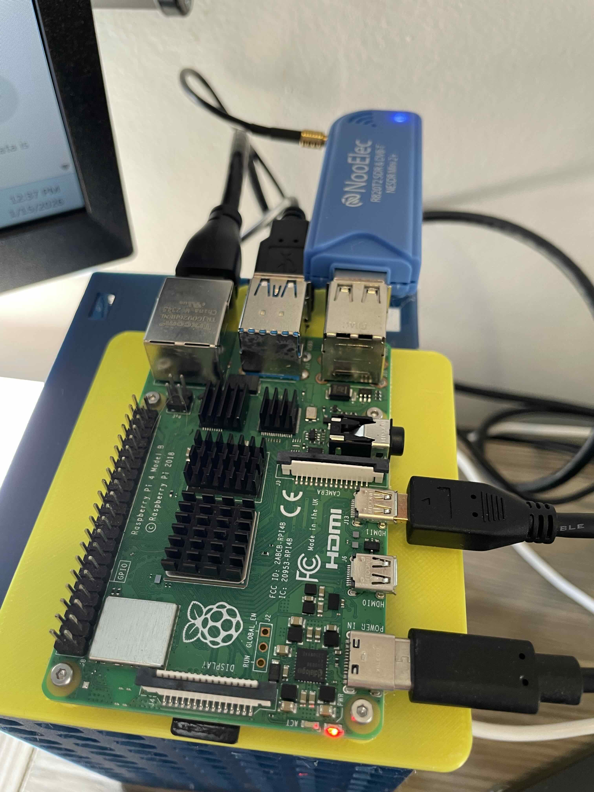
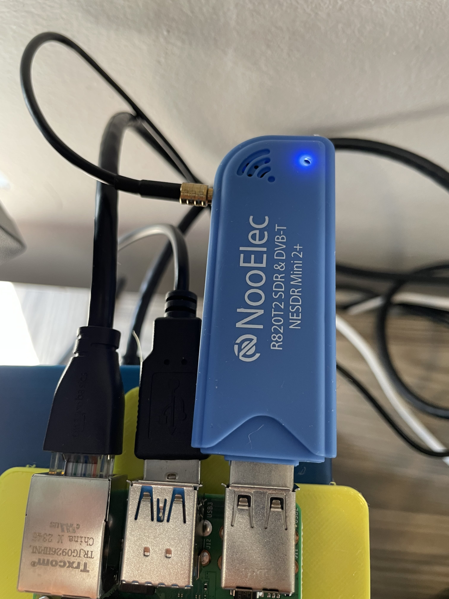

# Home Flight Data Contributor
End-to-end ADS-B setup using a Raspberry Pi and RTL-SDR:

- dump1090-mutability (decoder + JSON)
- Flightradar24 feeder (fr24feed)
- FlightAware feeder (piaware)
- Lightweight live flight map centered on your home





Tested on Raspberry Pi 4 / Debian Bookworm.

---

## Hardware

- Raspberry Pi 4 (2GB+ recommended)
- RTL-SDR v3 or equivalent
- External ADS-B antenna strongly recommended
- Stable power supply (USB issues cause dongle wedges)




---

## Quick Start

```bash
git clone https://github.com/xalfeiran/HomeFlightDataContributor.git
cd HomeFlightDataContributor

sudo bash scripts/install_base.sh
sudo bash scripts/install_dump1090_mutability.sh
sudo bash scripts/install_fr24feed.sh
sudo bash scripts/install_piaware.sh
sudo bash scripts/enable_services.sh
```

---

## Services & Ports

| Service | Port | Description |
| --- | --- | --- |
| dump1090 Beast TCP | 30005 | ADS-B data |
| dump1090 JSON | — | `/run/dump1090-mutability/aircraft.json` |
| fr24feed web | 8754 | Status UI |

---

## Live Viewer

Edit your home location:

```bash
cp config/viewer.env.example config/viewer.env
nano config/viewer.env
```

Then:

```bash
cd viewer
python3 -m venv .venv
source .venv/bin/activate
pip install -r requirements.txt
python app.py
```

Open:

`http://<PI_IP>:5000`

---

## Features

- Aircraft icon rotated by track
- Green = climbing, Red = descending
- Flight number label
- Zero heavy processing (reads dump1090 JSON only)

## Notes

- MLAT disabled is fine for local visualization
- Feeder benefits remain active if uptime & data quality are good
- This stack is safe to run alongside production systems

---

## License

MIT
